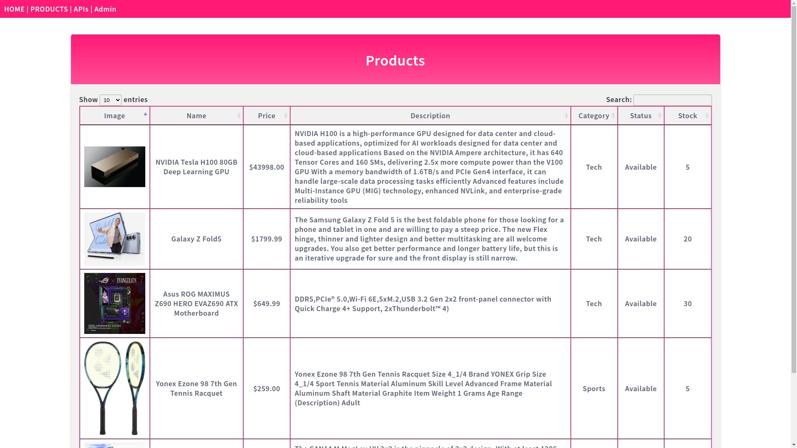
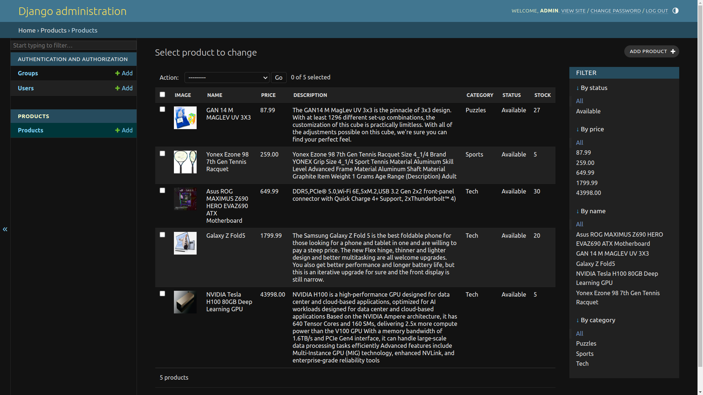
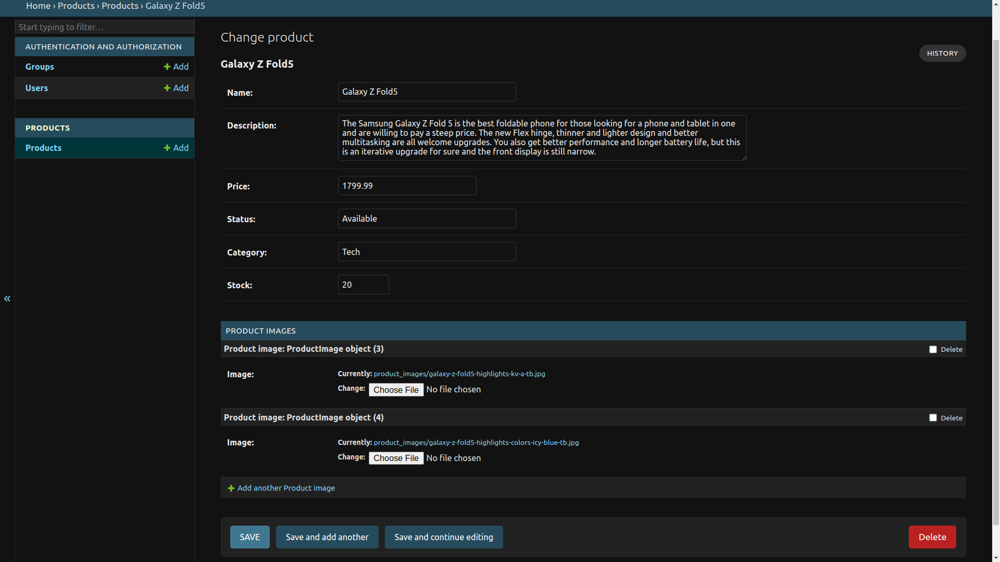

## Features

- User-friendly web interface for managing products.
- RESTful API for product and image management.
- Customized Django admin interface for product administration.
- Product listing page using DataTables.
- Token-based authentication for API access (JWT).
- Easily extensible for additional features.

## Installation

1. Clone the repository:

   ```bash
   git clone https://github.com/yourusername/ecommerce-product-management.git
   ```

2. Create a virtual environment:

   ```bash
   python -m venv venv
   ```

3. Activate the virtual environment:

   - On Windows:

     ```bash
     venv\Scripts\activate
     ```

   - On macOS and Linux:

     ```bash
     source venv/bin/activate
     ```

4. Install dependencies:

   ```bash
   pip install -r requirements.txt
   ```

5. Apply migrations:

   ```bash
   python manage.py migrate
   ```

6. Create a superuser for admin access:

   ```bash
   python manage.py createsuperuser
   ```
   or, use the default admin:admin

7. Start the development server:

   ```bash
   python manage.py runserver
   ```

## Usage

- Access the admin interface at `http://localhost:8000/admin/` and log in with your superuser credentials to manage products.
- View the product listing page at `http://localhost:8000/products/`.
- Access the API endpoints at `http://localhost:8000/api/`.

## API Endpoints

- "users": "/api/users/": GET, POST, HEAD, OPTIONS.
- "groups": "/api/groups/": GET, POST, HEAD, OPTIONS.
- "products": "api/products/": GET, POST, HEAD, OPTIONS.
- "images": "/api/images/": GET, POST, HEAD, OPTIONS.
- "token": "/api/token/": POST, OPTIONS.
- "refresh": "/api/token/refresh/": POST, OPTIONS.
- "verify": "/api/token/verify/": POST, OPTIONS.
